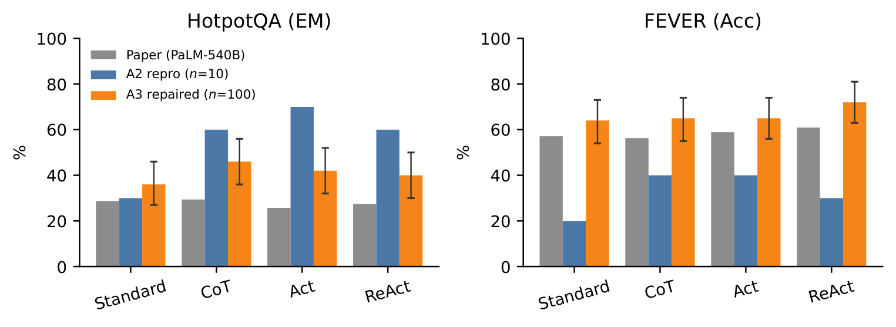
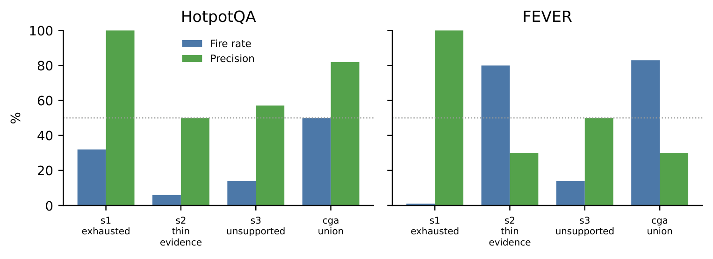
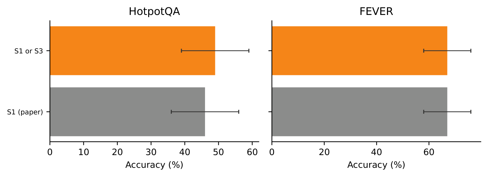
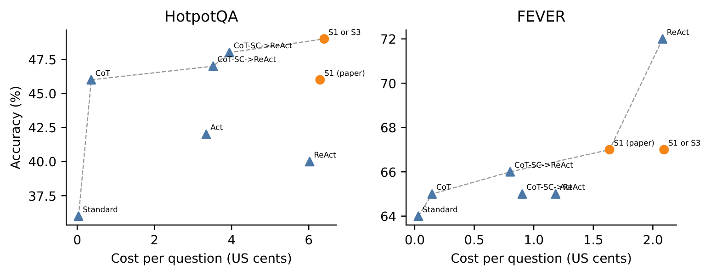

<!-- _class: title -->

# Confidence-Gated Adaptive Back-off

### Generalizing ReAct's hybrid trigger beyond step-exhaustion

 

**Assignment 3 — Paper Improvement Exploration**
Eugene · ReAct (Yao et al., ICLR 2023)

the paper's own fallback rule doesn't fire

---

## Roadmap

4 acts

- **Reproduce** — ReAct/CoT/Act/Standard + 2 hybrids, `z-ai/glm-5.2`, n=100/domain
- **Diagnose** — read the failure traces, find what the paper's trigger misses
- **Fix** — generalize the trigger into 3 validated signals ("CGA")
- **Prove** — validate signals *before* paying for the ablation, then ablate

 

HotpotQA · multi-hop QA &nbsp; FEVER · claim verification

---

## What ReAct actually does

Thought → Act → Observe

- Interleaves **reasoning** (*Thought*) with **actions** (*Search*, *Lookup*, *Finish*)
  against a live Wikipedia environment
- Section 3.3 adds two **hybrid** fallbacks with chain-of-thought self-consistency:
  - **ReAct → CoT-SC** — back off to an *n*-sample majority vote when ReAct fails
  - **CoT-SC → ReAct** — back off the other direction when the vote is too split
- Both directions need a **trigger**: a rule for *when* to switch strategies

---

## The reproduction

A2 → A3

- Reimplemented WikiEnv, all 4 base strategies + both hybrids
- Model: `z-ai/glm-5.2` (OpenRouter) standing in for PaLM-540B
- Assignment 2: **n=10** gate only — too small, trends didn't make sense
- Assignment 3: scaled to **n=100 per domain**, same items, same seed

7methods

2domains

100items / domain

---

## Two bugs fixed *before* touching the paper's idea

honesty check

- **Token truncation** — `max_tokens=256` cut completions off before `Answer:`;
  CoT-SC silently dropped empty votes. Raised to **512** for every arm equally.
- **No cost accounting** — added a thread-safe token/cost meter.

FEVER Standard 20%→64%, ReAct 30%→72% — the bug fix, not the trigger improvement.

---

## The limitation, found in the trajectories

read 20 real traces

8/10FEVER episodes: one Search, then Finish

0times the paper's trigger fired on them

- Gold label `NOT ENOUGH INFO` → model predicted `REFUTES`, **6/6 times**
- HotpotQA: paper's trigger works fine — failures burn all 7 steps, no `Finish`
- **The trigger isn't wrong — it's incomplete.** It only sees "stuck," never
  sees "confidently wrong on thin evidence"

---

## The fix: three signals

S1∨S2∨S3 = "CGA"

- **S1 — step exhaustion** *(paper's original condition, kept as control)*
- **S2 — evidence thinness** — fewer than τ informative observations before `Finish`
- **S3 — entailment check** — one extra LLM call: *"does the evidence support
  this answer?"* → back off on `INSUFFICIENT`

S3 costs 1 extra call, vs. the 21 calls of the CoT-SC arm it gates.

---

## Validate before you pay

test cheap, then spend

- Score each signal by **precision lift** = precision ÷ base error rate
- A signal firing on *everything* trivially matches the base rate — contributes nothing
- Ran this on the existing ReAct traces — **before** committing to a full ablation

---

## The negative result

reported, not hidden

- **S2 (evidence count) does not work:**
  - FEVER: fires 80/100 times, only **1.07×** precision lift — near-degenerate
  - HotpotQA: **0.67×** lift — *below* the base rate
- Evidence *count* ≠ evidence *quality*
- **Decision:** dropped all S2-containing arms from the paid ablation, spent the
  freed budget on S1∨S3 instead
- **S3 (entailment) works:** 1.79× lift on FEVER; combined with S1, **86.4%**
  precision on HotpotQA

---

## Ablation results

n=100, paired McNemar

<table style="font-size:0.52em">
<tr><th>Domain</th><th>Direction</th><th>Arm</th><th>Acc %</th><th>Δpp</th></tr>
<tr><td>HotpotQA</td><td>ReAct→CoT-SC</td><td>S1∨S3</td><td>49.0</td><td>+3.0</td></tr>
<tr><td>FEVER</td><td>ReAct→CoT-SC</td><td>S1∨S3</td><td>67.0</td><td>+2.0</td></tr>
<tr><td>HotpotQA</td><td>CoT-SC→ReAct</td><td>entropy-CGA</td><td>48.0</td><td>+1.0</td></tr>
</table>

Consistent direction, no regressions — not significant at n=100 (largest gap: 5 discordant pairs). Reported as directional, not confirmed.

---

## Cost vs. accuracy

+1 call vs. 21 it gates

Total measured spend for the full study: <strong>$38.80</strong> (trimmed from an initial 5×-too-low estimate, by user decision, before the paid run).

---

## Conclusion

the real point

- Paper's trigger only sees "stuck" (step exhaustion) — it misses "confidently
  wrong on thin evidence," the failure mode that **dominates on FEVER**
- **S3 fixes that gap**: 1 extra LLM call — *"does the evidence support this
  answer?"* — catches what step-counting can't
- **The economics are the point**: that 1 call gates a CoT-SC fallback that
  costs **21 calls**. S3 decides *whether to pay 21×*, for the price of 1
- Net effect: same or better accuracy, without inflating cost on the
  ~85% of episodes that didn't need the expensive fallback anyway

thank you — questions?

